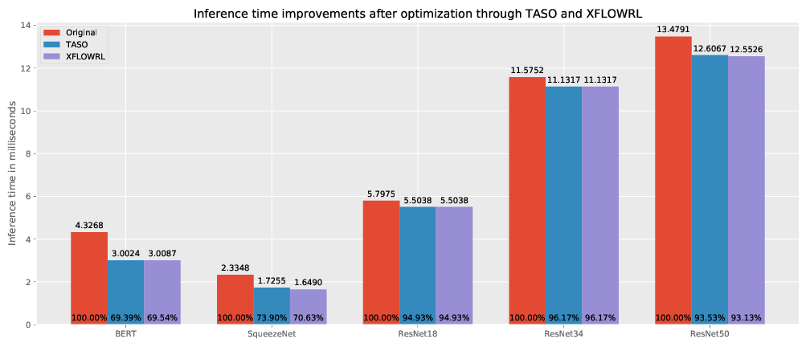
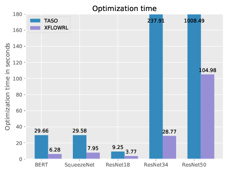
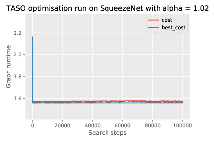
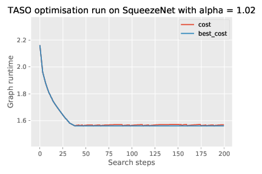

# Experiments

The runscripts for the experiments are located in
the [examples](xflowrl/examples) folder.

There are two different kind of graphs that are evaluated: 

1) [ONNX](https://github.com/onnx/onnx) exported neural network graphs
2) Graphs generated with the [NASbench](https://github.com/google-research/nasbench) framework

In both cases, there are runscripts to train an XFLOWRL agent (`*_xflowrl`), 
to run the default TASO search optimisaton (`*_taso_opt`) and lastly to do
inference using a trained model on some graphs after training (`*_inf`).

The training scripts are presented in full for the `onnx` experiments and are
moved into utility functions in the `nasbench` experiments. 

## ONNX

ONNX is a format to save (trained) neural networks for cross-compability. There
is a [ONNX Model Zoo](https://github.com/onnx/models) which can be used as a
data source.

Please note that not all ONNX models are compatible with TASO. This is because
the Op-specifications of ONNX are continuously updated, while TASO only supports
a specific OpSet. 

### Selecting the ONNX model

In the run scripts, there is a variable `graphs` that will contain all graphs
that the XFLOWRL agent should be trained on. It is populated by the 
`graph_files` and `skip_files` variable, like so:

```python
import glob
import taso as ts

def load_graph(filename):
    return ts.load_onnx(filename)

graph_files = glob.glob('graphs/**/*.onnx', recursive=True)
skip_files = {'graphs/vgg16.onnx', 'graphs/inception_v2.onnx', 'graphs/resnet34v1.onnx'}

graphs = []
for graph_file in graph_files:
    if graph_file in skip_files:
        continue
    print("Loading graph: {}".format(graph_file))
    graphs.append((graph_file, load_graph(graph_file)))

```

Alternatively, the graph files can be specified directly:

```python
graph_files = ['graphs/squeezenet1.1.onnx', 'graphs/resnet18v1.onnx']
```

Lastly, instead of using ONNX, we can build graphs directly in TASO and add
them to the graphs:

```python
from xflowrl.graphs.bert import build_graph_bert

graph_files.append('BERT')
graphs.append(('BERT', build_graph_bert()))
```

`build_graph_bert()` is the function that builds the TASO graph. It is directly
adapted from [TASO's example folder](https://github.com/jiazhihao/TASO/tree/master/examples). 

## NASbench

[NASbench](https://github.com/google-research/nasbench) is a framework used for
NAS algorithms. The authors did an exhaustive search over a specific search space
so that creators of NAS algorithms can just query their database.

We use the graph-generating module of their library to generate neural network
graphs from scratch as data input for our training.

Model building follows the [NASbench documentation](https://github.com/google-research/nasbench#using-the-dataset)
and looks like this:

```python
from nasbench import api
from xflowrl.graphs.nasbench import NasbenchTASO

INPUT = 'input'
OUTPUT = 'output'
CONV3X3 = 'conv3x3-bn-relu'
CONV1X1 = 'conv1x1-bn-relu'
MAXPOOL3X3 = 'maxpool3x3'

graphs = []

model_spec = api.ModelSpec(
    # Adjacency matrix of the module
    matrix=[[0, 1, 1, 1, 1, 1, 0],  # input layer
            [0, 0, 1, 0, 0, 0, 1],  # 1x1 conv
            [0, 0, 0, 1, 0, 0, 1],  # 3x3 conv
            [0, 0, 0, 0, 1, 0, 1],  # 5x5 conv (replaced by two 3x3's)
            [0, 0, 0, 0, 0, 1, 1],  # 5x5 conv (replaced by two 3x3's)
            [0, 0, 0, 0, 0, 0, 1],  # 3x3 max-pool
            [0, 0, 0, 0, 0, 0, 0]],  # output layer
    # Operations at the vertices of the module, matches order of matrix
    ops=[INPUT, CONV1X1, CONV3X3, CONV3X3, CONV3X3, MAXPOOL3X3, OUTPUT])

ng = NasbenchTASO()
graph = ng.build_model(model_spec, {
    'num_stacks': 3,
    'num_modules_per_stack': 3,
})
graphs.append(('NASbench-3x3', graph))
```

# Initial results

First, we ran TASO and XFLOWRL on BERT, SqueezeNet, ResNet18, ResNet34, and ResNet50
and compared the final graph runtimes:



As you can see, both TASO and XFLOWRL improved the final graph runtimes. In
most cases, TASO and XFLOWRL achieved the same improvement.

Next, we examined the optimisation time, i.e. the time it takes for each
method to find the best graph:



As you can see, XFLOWRL is (much) faster than TASO in inference. There are two
caveats here: First, XFLOWRL requires (long) training, which TASO does not.
Second, the TASO search used the default parameters, which allocated a budget
of 1000 search iterations to find the best graph. This takes a very long time.
In practice, the best graphs are usually found after much fewer search iterations,
about 100-120. An early stopping algorithm or just allocating a lower budget
would be able to dramatically cut the TASO search time.

We illustrate this below. Here is a TASO search with 100,000 iterations:



And here a zoomed-in version of the same data (only 200 iterations displayed):



As you can see, in SqueezeNet the best cost graph is found after only about
40 search steps. For the next 999,960 steps, no better configuration is found.

**Summary**: While XFLOWRL is able to find well-performing graphs on a level
with TASO's backtracking search, there is currently no benefit in using RL
over TASO

## Reasons for these results

As shown in the SqueezeNet example above, TASO seems to be able to find 
close-to-optimal results very fast. Extending the search space towards a
more exhaustive search didn't yield any better performing graphs. Due to 
memory constraints, no full exhaustive search has been run.

We explored two avenues to find setups where TASO might not perform well
and where XFLOWRL could thus have an edge:

1. Running optimisation on more complex graphs
2. Adjusting the runtime measurements

## Running optimisation on more complex graphs

SqueezeNet, and most of the other networks we tested, were simple and rather
small networks. Thus, we explored if XFLOWRL had an edge over TASO in more
complex graphs.

Here is an overview of the graph complexities:

```plain
----------------------------------------
Graph: graphs/squeezenet1.1.onnx
XFER ID: 0 - Count: 17
XFER ID: 9 - Count: 1
XFER ID: 12 - Count: 8
XFER ID: 112 - Count: 6
XFER ID: 113 - Count: 8
XFER ID: 138 - Count: 8
Total number of available substitutions: 6
Total available locations for graph substitutions: 48
----------------------------------------
Graph: graphs/resnet18v1.onnx
XFER ID: 1 - Count: 13
XFER ID: 7 - Count: 7
Total number of available substitutions: 2
Total available locations for graph substitutions: 20
----------------------------------------
Graph: graphs/resnet50v1.onnx
XFER ID: 1 - Count: 46
XFER ID: 7 - Count: 7
XFER ID: 12 - Count: 2
XFER ID: 145 - Count: 2
Total number of available substitutions: 4
Total available locations for graph substitutions: 57
----------------------------------------
Graph: graphs/resnet152v1.onnx
XFER ID: 1 - Count: 148
XFER ID: 7 - Count: 7
XFER ID: 12 - Count: 2
XFER ID: 145 - Count: 2
Total number of available substitutions: 4
Total available locations for graph substitutions: 159
----------------------------------------
Graph: BERT
XFER ID: 95 - Count: 80
Total number of available substitutions: 1
Total available locations for graph substitutions: 80
```

The important measure here is the total number of graph substitutions. 
Approximately, the number of possible combinations should be on the order
of O(N^2), where N is the total number of graph substitution locations. This
is because for each possible location, we can either apply or not apply the
substitution. Thus, the higher this number, the more complex the search space
should be (though number of different XFERs should also play a role).

We used the [NASbench library](https://github.com/google-research/nasbench) to 
generate more complex graphs. For a 3x3 cell, we found the following complexity:

```plain
XFER ID: 1 - Count: 73
XFER ID: 12 - Count: 81
XFER ID: 113 - Count: 87
XFER ID: 138 - Count: 87
XFER ID: 145 - Count: 54
Total number of available substitutions: 5
Total available locations for graph substitutions: 382 
```

Training on this graph took a very long time. Unfortunately, even here
we weren't able to perform better than TASO. Thus, we would potentially
need much more complex graphs - but this was unfeasible due to memory
constraints. Larger graphs were unable to be loaded into the GPU memory
by our machines.

## Adjusting the runtime measurements

TASO measures execution times for graph substitutions separately and one
time at the start of a search and then uses these times to *estimate* the
final graph runtime. Thus, in reality we are not optimising the *real*
graph runtime, but an estimation.

TASO does this to avoid measuring graph runtimes. At each search step, TASO
applies all possible transformations and estimates their runtimes. If they
did a real time measurement, they would have to run O(N^T) measurements, where
T is the number of search steps. Even with the constrained search space (only
keeping graphs that at most increase the runtime by a fixed relative amount),
this would lead to very long search times.

In practice, the estimations are good enough to find well performing graphs.
However, it is unlikely that these are really optimal graphs, because the
estimations don't take chain effects into account. Thus, if we
used real time measurements instead of estimated ones, XFLOWRL might have
an edge there.  

We prepared for using real time measurements. In the TASO patch 
`TASO_02_run_memorysafe.patch`, we added a function `run_memorysafe()` which
measures the real graph runtime, while avoiding some major memory leaks.
Before that, a memory leak retained all measured graphs, leading to an increase
in GPU memory usage of a few hundred megabytes per measurement. With the current 
version, this increase is reduced to about 2MB per measurement. This is still
too much for a full RL training run, so this should be explored further.

Thus, the `HierarchicalEnvironment` class now accepts a `real_measurements`
parameter, toggling use of estimated or real runtime measurements. We weren't
able to run experiments, yet, but this might be a viable future directive.

## Future directives

Next, the two avenues outlined above should be explored further:

1. Running on more complex graphs
   - It would be interesting to see if we can generate arbitrarily 
     complex graphs (without NASbench) to see if there is a case
     where TASO performs substantially worse than XFLOWRL
2. Using real time measurements
   - The small remaining memory leak has to be fixed
   - After that, compare TASO search on estimated runtimes, TASO search
     on measured runtimes, and XFLOWRL training on real runtimes
3. Possibly combine both approaches

